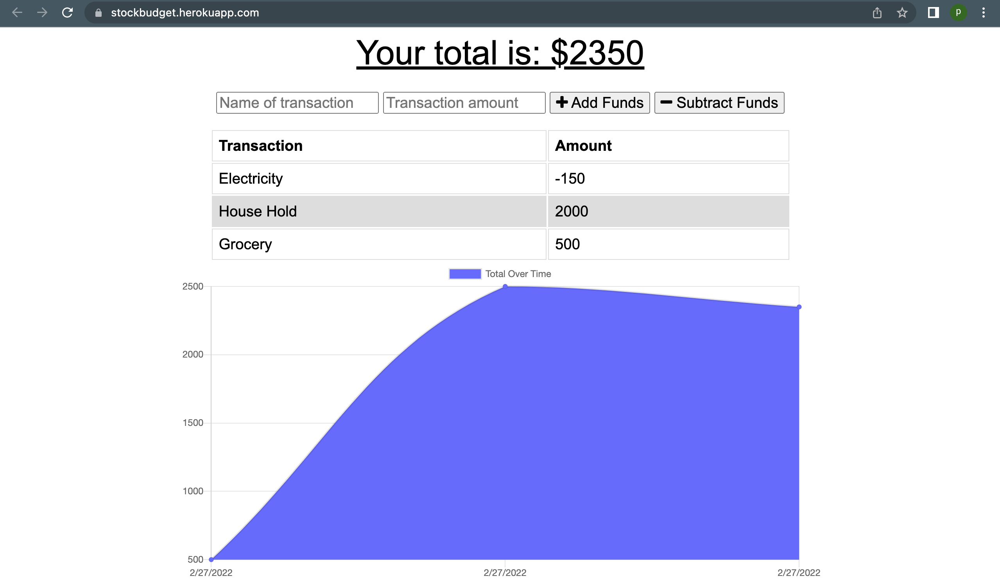
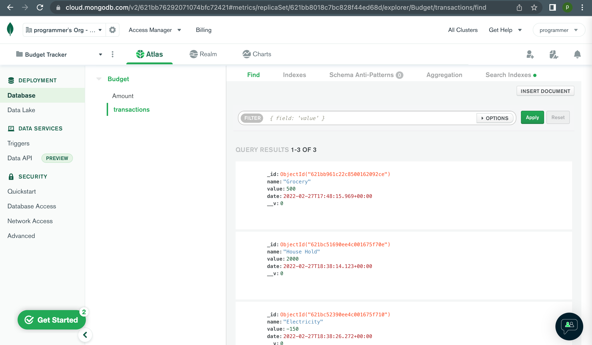

# Stock-Tracker

## Description
The challenge this week is to update an existing budget tracker application to allow for offline access and functionality. The user will be able to add expenses and deposits to their budget with or without a connection. You’ll need to deploy this application to Heroku using MongoDB Atlas.

## Table of Contents
  - [Installation](#installation)
  - [Dependencies](#dependencies)
  - [Usage](#usage)
  - [URL](#url)
  - [Screenshot](#screenshot)
  - [Questions](#questions)
  
## Installation
Run `npm install` to install the dependencies. The budget tracker has a server and uses MongoDB as its database.

## Dependencies

        * express
        * mongoose
        * compression
        * morgan
        * nodemon
        
## Usage
Run `npm start` to start the server. 

## Heroku URL
https://stockbudget.herokuapp.com/

## Screenshot

## Questions
- Github: [zeeshan](https://github.com/zeeshanmufti1995)

  
